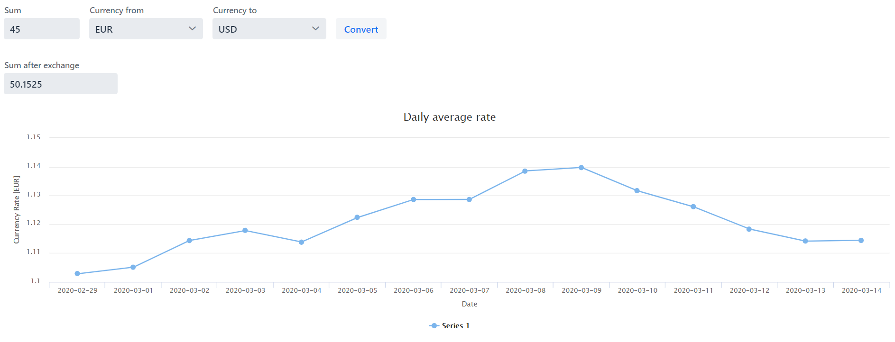

# MoneyExchangePoint

Application which allows to exchange money between specified currencies using Vaadin framework.

Current currency exchange rate is gained from 'Foreign exchange rates and currency conversion JSON API'.

